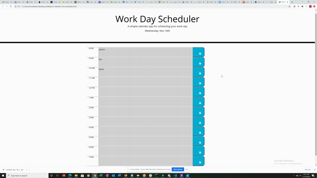

# 5-Workday Scheduler

This is a basic workday scheduler that is meant to allow you to take notes for specific hour blocks of the day. The hour blocks will change color depending if the time is past, currently, or going to be a future hour.

* Use of JavaScript
* Use of CSS
* Use of HTML

## Usage

This is a basic workday scheduler that is meant to allow you to take notes for specific hour blocks of the day. The hour blocks will change color depending if the time is past, currently, or going to be a future hour. This utilizes local storage functions within the browser. Simply click the save button after typing anything into the colored time block areas to store notes.



## Code

Time Sequence Function:

```
    function calendarDisplay() {  

        $(".timeBlock").each(function () {
            var hourBlock = parseInt($(this).attr('id').split('hour')[1]);
            console.log(hourBlock, momentTime)    
            
            if (hourBlock < momentTime){
                $(this).addClass('past');
                $(this).removeClass('future')
                $(this).removeClass('present')
            } 
            
            else if (hourBlock > momentTime) {
                $(this).removeClass('past');
                $(this).addClass('future');
                $(this).removeClass('present')
            }

            else {
                $(this).removeClass('past');
                $(this).addClass('present');
                $(this).removeClass('future')
            }

        })
    }   
```

## Credits

* https://github.com/coding-boot-camp/
* https://stackoverflow.com/questions/
* https://guides.github.com/features/mastering-markdown/

## Built With

* [JavaScript](https://developer.mozilla.org/en-US/docs/Web/JavaScript)
* [CSS](https://developer.mozilla.org/en-US/docs/Web/CSS)
* [HTML](https://developer.mozilla.org/en-US/docs/Web/HTML)

## Authors

* **Daniel Cuadra** 

- [GitHub](https://github.com/DCuadra85)
- [LinkedIn](https://www.linkedin.com/in/daniel-cuadra-3705aa39/)


## License

MIT License

Copyright (c) [2020] [DanielCuadra]

Permission is hereby granted, free of charge, to any person obtaining a copy
of this software and associated documentation files (the "Software"), to deal
in the Software without restriction, including without limitation the rights
to use, copy, modify, merge, publish, distribute, sublicense, and/or sell
copies of the Software, and to permit persons to whom the Software is
furnished to do so, subject to the following conditions:

The above copyright notice and this permission notice shall be included in all
copies or substantial portions of the Software.

THE SOFTWARE IS PROVIDED "AS IS", WITHOUT WARRANTY OF ANY KIND, EXPRESS OR
IMPLIED, INCLUDING BUT NOT LIMITED TO THE WARRANTIES OF MERCHANTABILITY,
FITNESS FOR A PARTICULAR PURPOSE AND NONINFRINGEMENT. IN NO EVENT SHALL THE
AUTHORS OR COPYRIGHT HOLDERS BE LIABLE FOR ANY CLAIM, DAMAGES OR OTHER
LIABILITY, WHETHER IN AN ACTION OF CONTRACT, TORT OR OTHERWISE, ARISING FROM,
OUT OF OR IN CONNECTION WITH THE SOFTWARE OR THE USE OR OTHER DEALINGS IN THE
SOFTWARE.